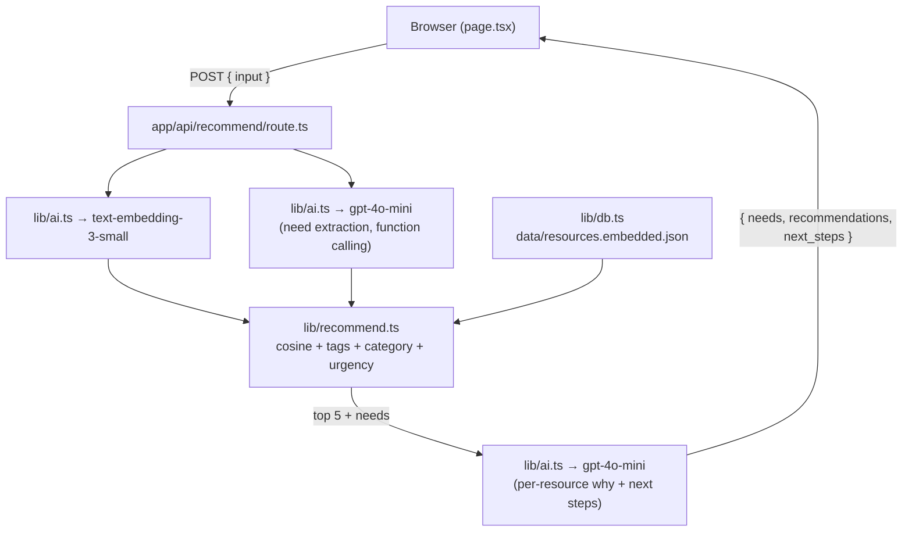

# UW Compass

An AI-powered resource finder for University of Washington students. Describe your situation in plain language and get pointed to the right official UW resources, with explanations and a clear next step.

> CSS 382 — Introduction to Artificial Intelligence · DYOP group project

- **App:** local — `npm run dev` (live URL pending)
- **About / how it works:** [/about](app/about/page.tsx) on the deployed app
- **Repository:** https://github.com/aryank09/UW-Compass

## Quick start

```bash
npm install
cp .env.example .env.local        # then put your OpenAI key in .env.local
npm run seed                      # generates embeddings for the curated resource set
npm run dev                       # http://localhost:3000
```

You need an [OpenAI API key](https://platform.openai.com/api-keys) **with billing enabled**. Seeding all 31 resources costs a fraction of a cent on `text-embedding-3-small`.

## What it does

1. Student types something like *"I'm overwhelmed, behind in math, and need a quiet place to study."*
2. The app extracts **structured needs** (`academic`, `study_space`) with intensities and supporting evidence using `gpt-4o-mini` + function calling.
3. In parallel, it embeds the same input with `text-embedding-3-small`.
4. It computes a combined score against every resource — embedding similarity, category match, tag overlap, urgency boost — then takes the top 5 with category diversification.
5. `gpt-4o-mini` writes a short per-resource explanation and a 2–4 step action plan.
6. The UI shows the extracted needs, ranked recommendations with links to official UW pages, and the next-step plan.

## Architecture



Three OpenAI calls per request: 1 embedding + 2 chat completions (embed and need extraction run in parallel). Resource embeddings are computed once at seed time.

## Project layout

```
app/
  layout.tsx              root layout
  page.tsx                client-side form + results UI
  about/page.tsx          project website (overview, AI, user guide)
  globals.css             tailwind entrypoint
  api/recommend/route.ts  POST endpoint
lib/
  types.ts                Resource, ExtractedNeed, Recommendation, Category
  db.ts                   reads data/resources.embedded.json at build time
  ai.ts                   OpenAI calls: embed, extractNeeds, summarize
  recommend.ts            cosine similarity + ranking + diversification
data/
  resources.json          curated UW resources (edit this to add/update)
  resources.embedded.json generated by `npm run seed` — committed so Vercel builds work
scripts/
  seed.ts                 reads resources.json, computes embeddings, writes embedded JSON
  check-links.ts          HEAD-checks every URL in resources.json
tests/
  recommend.test.ts       ranker unit tests
  resources.test.ts       schema validation + UW-domain check
  scenarios.test.ts       the 5 proposal evaluation scenarios
```

## Updating the resource set

Resources live in [`data/resources.json`](data/resources.json). Each entry has:

```ts
{
  id: string;            // stable slug, used as primary key
  name: string;          // display name
  category: 'academic' | 'wellness' | 'basic_needs' | 'transportation'
          | 'study_space' | 'career' | 'financial';
  campus: 'seattle' | 'bothell' | 'tacoma' | 'all';
  description: string;   // 1–3 sentences; this is what gets embedded
  url: string;           // official UW page
  tags: string[];        // snake_case fine-grained tags
  urgent: boolean;       // true for crisis-time resources (SafeCampus, Husky HelpLine, etc.)
}
```

After editing, re-run `npm run seed` to refresh embeddings, then `npm run check-links` to verify URLs.

## Tuning the ranker

Weights live in [`lib/recommend.ts`](lib/recommend.ts):

```ts
weights: {
  embedding:     0.5,   // semantic similarity (cosine of student input vs. resource description)
  categoryMatch: 0.25,  // does the resource's category match an extracted need?
  tagOverlap:    0.15,  // share of extracted tags that appear in the resource's tag list
  urgencyBoost:  0.1,   // student appears urgent AND resource is flagged urgent
}
```

Adjust and re-run `npm test` to check that all 5 evaluation scenarios still pass.

## Testing

```bash
npm test            # full test suite (Vitest)
npm run check-links # HEAD-checks every URL in resources.json
npm run typecheck   # tsc --noEmit
```

The scenario tests bypass OpenAI by hand-crafting expected `ExtractedNeed[]` for each of the proposal's five evaluation scenarios (§9) and asserting the ranker surfaces matching resources in the top 5.

Manual smoke test against a running dev server:

```bash
curl -s -X POST http://localhost:3000/api/recommend \
  -H "content-type: application/json" \
  -d '{"input":"I am failing calculus and need help."}' | jq
```

## Deployment (Vercel)

The app deploys directly to Vercel — no database server needed because resource embeddings are bundled as `data/resources.embedded.json` at build time.

1. Push to `main`.
2. Import the repo at [vercel.com/new](https://vercel.com/new) (you need push access).
3. Add `OPENAI_API_KEY` under **Environment Variables**.
4. Deploy. Every subsequent push to `main` auto-deploys.

If your GitHub account doesn't own the repo, the CLI alternative (`vercel login && vercel --prod`) works from any clone.

**Set a monthly spend cap** at [platform.openai.com/settings/organization/limits](https://platform.openai.com/settings/organization/limits) so a runaway script can't drain your account.

## Milestone status (proposal §13)

- [x] **Week 1** — repo + seeded resource DB + working `/api/recommend`
- [x] **Week 2** — end-to-end AI pipeline + frontend + 5 scenarios verified
- [ ] **Week 3** — public deployment, project website, final polish

### Done

- [x] 31 curated resources across all 7 proposal categories
- [x] OpenAI embedding + need-extraction + summarization pipeline
- [x] Ranked recommendations with multi-signal scoring + category diversification
- [x] Single-page React UI with example prompts, urgent banner, next-step plan
- [x] Project website at `/about` (overview, impact, architecture, AI explanation, user guide)
- [x] Vitest test suite — 26 tests covering ranker + schema + 5 scenarios
- [x] Link-health checker script (mitigates the "resources go stale" risk from §15)

### Stretch goals from §5

- [x] Campus filter (All / Seattle / Bothell / Tacoma) — pill selector above the input
- [ ] Feedback buttons ("helpful" / "not helpful") with anonymous logging
- [ ] Saved recommendations (localStorage)
- [ ] Multilingual input

## License

Educational project. Resource content links to official UW pages and is not a substitute for them. For emergencies call 911 or contact [SafeCampus](https://www.washington.edu/safecampus/).
